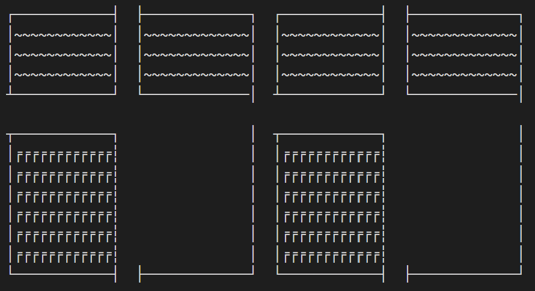
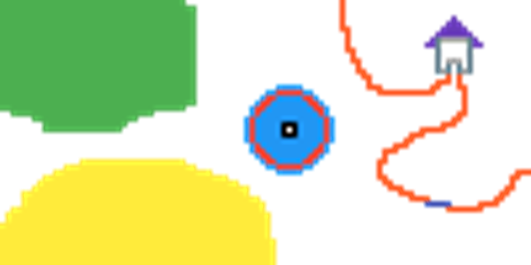

# Everything you need to know about Maps

A `Map` is an area that a player can explore in the game. Tetra is only capable of rendering a text-based map wherein each 'tile' is occupied by a unicode character. For example;



The entire game comprises of several such `Map` objects stitched together to create an immersive world. It is strongly advised to split the world into multiple `Map` objects instead of a single large `Map`. 

## Surfaces
Each unique unicode character used in the `Map` is associated with a `Surface` object, which can carry certain properties that change how the player can interact with that tile. We can broadly classify a `Surface` as being a functional unit with some interaction mechanics, or a purely aesthetic object, i.e, a `Decoration` (for eg. solid walls, houses, etc). 

### Creating a surface
A json file with a `.surface` suffix is used to store the metadata for each surface object. A typical surface file will look like so:

```
{
    "name" : "Ground",
    "character" : " ",
    "walkable" : true
}
```

If a surface file is created, it **must** have atleast these three properties, wherein `walkable` indicates whether the player can traverse over the tile. Additional properties may be added, accompanied by the code to handle these properties within the game to introduce new mechanics for these surfaces. (How?)

#### Decoration tiles
Some surface tiles may serve a purely aesthetic purpose and it becomes cumbersome to create  `.surface` files for all such tiles. Such surfaces are classified as a `Decoration` which is assigned by default if the `.surface` file for a specific unicode character does not exist. 

The equivalent property list for any `<character>` which is a `Decoration` might look like so: 

```
{
    "name" : "Decor",
    "character" : <character>,
    "walkable" : false
}
```
Now that we have dealt with the building blocks of a `Map`, let us move on to the actual `Map` object.
## Maps

A json file with a `.map` suffix is used to store the metadata for each `Map` object. A typical map file will look like so:

```
{
    "name": "Home",
    "raw" : "┌────────────┤  ├─────────────┐  ┌────────────┤  ├─────────────┐
│~~~~~~~~~~~~│  │~~~~~~~~~~~~~│  │~~~~~~~~~~~~│  │~~~~~~~~~~~~~│
│~~~~~~~~~~~~│  │~~~~~~~~~~~~~│  │~~~~~~~~~~~~│  │~~~~~~~~~~~~~│
│~~~~~~~~~~~~│  │~~~~~~~~~~~~~│  │~~~~~~~~~~~~│  │~~~~~~~~~~~~~│
┴────────────┘  └─────────────│  ┴────────────┘  └─────────────│
                                                                
┬────────────┐                │  ┬────────────┐                │
│╒╒╒╒╒╒╒╒╒╒╒╒┆                │  │╒╒╒╒╒╒╒╒╒╒╒╒┆                │
│╒╒╒╒╒╒╒╒╒╒╒╒┆                │  │╒╒╒╒╒╒╒╒╒╒╒╒┆                │
│╒╒╒╒╒╒╒╒╒╒╒╒┆                │  │╒╒╒╒╒╒╒╒╒╒╒╒┆                │
│╒╒╒╒╒╒╒╒╒╒╒╒┆                │  │╒╒╒╒╒╒╒╒╒╒╒╒┆                │
│╒╒╒╒╒╒╒╒╒╒╒╒┆                │  │╒╒╒╒╒╒╒╒╒╒╒╒┆                │
│╒╒╒╒╒╒╒╒╒╒╒╒┆                │  │╒╒╒╒╒╒╒╒╒╒╒╒┆                │
└────────────┤  ├─────────────┘  └────────────┤  ├─────────────┘",
    "init_pos": [5, 1],
    "exits":{
                "5,0" : ["Large Home", [5, 95]],
                "5,63" : ["Large Home", [5, 1]]
                },
    "items": {
        "Teleporter": [13, 47],
        "Shoe": [11, 47]
    }
}
```

### Name
This is a unique identifier for each `Map`, with some relevance to the area it is meant to depict. 

### Raw
This field carries the raw text data comprising of unicode characters, separated by newline (`\n`) characters to start a new line of the map.

A simple coordinate system is utilized to refer to specific tiles, namely `[x, y] == [row, col]`. This restrict the coordinates like so; `0 <= x <= nrows` and `0 <= y <= ncols`.  

### Init_pos
This is simply the spawn coordinates for the player, utilized only if the `Map` is set as the `Home` (the starting map when the game is launched) for the player. 

**Note:** Do not set any coordinate over a non-walkable surface tile! This will cause the player to get stuck with no fix other than to restart the game.

### Exits
This is an important field that provides information on map transitions (switching from one `Map` to another). For example, such a transition could be between the connection of two areas, or to enter a building, etc. 

Three pieces of information are required to create a link between two `Map` objects for such a transition. Let us take two maps, Home (current map) and Large Home (map to transition to) for instance;

- `[x_i, y_i]` - co-ordinates in Home where the player must stand, to trigger the transition.
- `Large Home` - the target maps name (since the name is a unique identifier for `Map` objects).
- `[x_f, y_f]` -  co-ordinates in Large Home where the player will transport to, after the transition has been triggered.

Multiple such transition points may exist, so the `exits` field is a dictionary with key-pair values like so:
```
"x_i, y_i" : ["Large Home", [x_f, y_f]]
```
The odd structure of this specification is due to limitations of json files, but the above example should suffice to specify your own exit points. A specification with multiple exit points might look like the following:

```
"exits":{
            "5,0" : ["Large Home", [5, 95]],
            "5,63" : ["Larger Home", [5, 1]],
            .
            .
            .
            "5,1" : ["Even Larger Home", [5, 95]],
            "5,60" : ["Largest Home", [5, 1]]
            },
```

**Note**: The last coordinate in the dictionary should not have a trailing `,` but *every* entry preceding it must have one. In case of a single exit point, this would look like so:

```
"exits":{
            "5,0" : ["Large Home", [5, 95]]
        },
```

**Another Note**: Although the process of constructing this data is cumbersome, you can use the in-built GPS gadget in the game to quickly identify the coordinates involved in these transitions.

### Items
This field simply specifies the locations of various `Item` objects to be placed in the `Map`. Further details to create an `Item` object can be found in the [Items 101](items.md) section. 

The `items` field is also a dictionary with key-pair values like so:
```
"<item name>" : [x_pos, y_pos]
```

A typical specification with multiple items looks like so:

```
"items": {
    "Teleporter": [13, 47],
    "Shoe": [11, 47],
    "Mirror": [16, 34]
}
```

# Making your own Maps
Now that we know how to provide the meta-data for a `Map` object, how do we create the Raw text map? It is quite cumbersome to type out each character by hand, so we have written a Map Creation Tool which is a jupyter notebook that facilitates this process. It can be found in the path `/helpers/map_creation_tool.ipynb`. 

## The Input


You can create a map visually by using any pixel art engine (we recommend https://www.pixilart.com/). Use colors instead of unicode characters to draw the map, and feed it into the Map Creation Tool to convert it to unicode. 
## The Output
```
~~~~~~~~~~~~~~~~~~~~~~~~~~~~~~~~~~~                             #                                   
~~~~~~~~~~~~~~~~~~~~~~~~~~~~~~~~~~~~~                           #                                   
~~~~~~~~~~~~~~~~~~~~~~~~~~~~~~~~~~~~~                           #                                   
~~~~~~~~~~~~~~~~~~~~~~~~~~~~~~~~~~~~~                           #                    %              
~~~~~~~~~~~~~~~~~~~~~~~~~~~~~~~~~~~~~                           #                   %%%             
~~~~~~~~~~~~~~~~~~~~~~~~~~~~~~~~~~~~~                           ##                 %%%%%            
~~~~~~~~~~~~~~~~~~~~~~~~~~~~~~~~~~~~~                            #                %%%%%%%           
~~~~~~~~~~~~~~~~~~~~~~~~~~~~~~~~~~~~~                            #               %@_____@%          
~~~~~~~~~~~~~~~~~~~~~~~~~~~~~~~~~~~~~                            #              %%@     @%%         
~~~~~~~~~~~~~~~~~~~~~~~~~~~~~~~~~~~~~                            ##               @     @           
~~~~~~~~~~~~~~~~~~~~~~~~~~~~~~~~~~~~~                             #               @     @           
~~~~~~~~~~~~~~~~~~~~~~~~~~~~~~~~~~~~~                             ##              @ ___ @           
~~~~~~~~~~~~~~~~~~~~~~~~~~~~~~~~~~~~~                              #              @ @ @ @           
~~~~~~~~~~~~~~~~~~~~~~~~~~~~~~~~~~~~~                              ##             @_@ @_@           
~~~~~~~~~~~~~~~~~~~~~~~~~~~~~~~~~~~~~                               ##              # #             
~~~~~~~~~~~~~~~~~~~~~~~~~~~~~~~~~~~~~                                #            ### #             
~~~~~~~~~~~~~~~~~~~~~~~~~~~~~~~~~~~~~               ooooo            ###         ##   ##            
~~~~~~~~~~~~~~~~~~~~~~~~~~~~~~~~~~~~~             oo$$$$$oo            ###########     #            
~~~~~~~~~~~~~~~~~~~~~~~~~~~~~~~~~~~~~            o$$ooooo$$o                           #            
~~~~~~~~~~~~~~~~~~~~~~~~~~~~~~~~~~~~~           o$$ooooooo$$o                          #            
~~~~~~~~~~~~~~~~~~~~~~~~~~~~~~~~~~~            o$$ooooooooo$$o                         #            
  ~~~~~~~~~~~~~~~~~~~~~~~~~~~                  o$ooooooooooo$o                        ##            
      ~~~~~~~~~~~~~~~~~~~~                    o$ooooooooooooo$o                      ##             
        ~~~~~~~~~~~~~~~~                      o$ooooo+++ooooo$o                    ###              
        ~~~~~~~~~~~~~~~                       o$ooooo+$+ooooo$o                #####                
                                              o$ooooo+++ooooo$o              ###                    
                                              o$ooooooooooooo$o             ##                      
                                               o$ooooooooooo$o            ###                       
                                               o$$ooooooooo$$o          ###                         
                                                o$$ooooooo$$o           #                           
               ^^^^^^^^^^^^^^^^^^^^              o$$ooooo$$o           ##                           
            ^^^^^^^^^^^^^^^^^^^^^^^^^             oo$$$$$oo            #                            
          ^^^^^^^^^^^^^^^^^^^^^^^^^^^^^^            ooooo              #                         ###
        ^^^^^^^^^^^^^^^^^^^^^^^^^^^^^^^^^^^                            ##                       ##  
       ^^^^^^^^^^^^^^^^^^^^^^^^^^^^^^^^^^^^^^                           ##                      #   
      ^^^^^^^^^^^^^^^^^^^^^^^^^^^^^^^^^^^^^^^^^                          ###                   ##   
    ^^^^^^^^^^^^^^^^^^^^^^^^^^^^^^^^^^^^^^^^^^^                            ###                ##    
    ^^^^^^^^^^^^^^^^^^^^^^^^^^^^^^^^^^^^^^^^^^^^^                            ####            ##     
    ^^^^^^^^^^^^^^^^^^^^^^^^^^^^^^^^^^^^^^^^^^^^^^                              -----     ####      
  ^^^^^^^^^^^^^^^^^^^^^^^^^^^^^^^^^^^^^^^^^^^^^^^^                                  #######         
 ^^^^^^^^^^^^^^^^^^^^^^^^^^^^^^^^^^^^^^^^^^^^^^^^^^                                                 
 ^^^^^^^^^^^^^^^^^^^^^^^^^^^^^^^^^^^^^^^^^^^^^^^^^^                                                 
^^^^^^^^^^^^^^^^^^^^^^^^^^^^^^^^^^^^^^^^^^^^^^^^^^^                                                 
^^^^^^^^^^^^^^^^^^^^^^^^^^^^^^^^^^^^^^^^^^^^^^^^^^^                                                 
^^^^^^^^^^^^^^^^^^^^^^^^^^^^^^^^^^^^^^^^^^^^^^^^^^^                                                 
^^^^^^^^^^^^^^^^^^^^^^^^^^^^^^^^^^^^^^^^^^^^^^^^^^^^                                                
^^^^^^^^^^^^^^^^^^^^^^^^^^^^^^^^^^^^^^^^^^^^^^^^^^^^                                                
^^^^^^^^^^^^^^^^^^^^^^^^^^^^^^^^^^^^^^^^^^^^^^^^^^^^                                                
^^^^^^^^^^^^^^^^^^^^^^^^^^^^^^^^^^^^^^^^^^^^^^^^^^^^                                                
^^^^^^^^^^^^^^^^^^^^^^^^^^^^^^^^^^^^^^^^^^^^^^^^^^^^                                                
```
You will have to map each color to a specific character (based on how good it looks) and the tool will generate the raw text map that is required.

## The Process
The jupyter notebook provides step-by-step instructions to generate the finale output. In fact, it also creates the `.map` file and corresponding `.surface` files for every unique tile in the map, based on a series of prompts which you will have to answer. 

## Things to keep in mind while designing the map

- Each pixel corresponds to a single unicode character, so start with an empty canvas of appropriate dimensions (of the order of ~ 100 x 100 sq. pixels). 
- The player occupies one tile in the map, so build all other objects with proper scale relative to the player. 
- Each different type of tile *must* be designated with a different color! The Map Creation Tool cannot distinguish them otherwise. For example; vertical, horizontal and corners of a "wall" must be denoted by different colors since functionally they are all walls, but require different unicode characters to be displayed in their place.